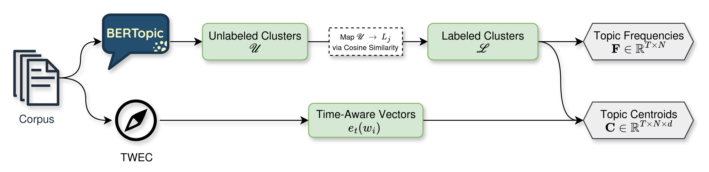

# Central Bank Speech Analysis Pipeline

This repository implements the methodology from the paper *Convergence and Divergence in Central Bank Speeches: Evidence from ECB and Fed*. The pipeline processes ECB and Fed speeches to extract topics, track their evolution over time, and analyze convergence or divergence patterns between the two institutions.

---

## Pipeline Overview

The pipeline, located in `develop/pipe`, performs the following steps:

1. **Data Processing** – Extract paragraphs from the speech corpus and clean text.  
2. **Topic Extraction** – Use BERTopic to generate unlabeled topics from paragraphs.  
3. **Label Matching** – Map extracted topics to predefined labels using cosine similarity.  
4. **Aggregation** – Compute yearly centroid embeddings for topics to analyze evolution over time.



Besides the ECB and Fed speeches, this pipeline can be applied to analyze any two corpora of your choice to study topic convergence and divergence over time.

---

## Requirements

- Python 3.9.7
- Install dependencies:
```bash
pip install -r requirements.txt
```
---

## License

This project is licensed under the MIT License. See the [LICENSE](LICENSE) file for details.